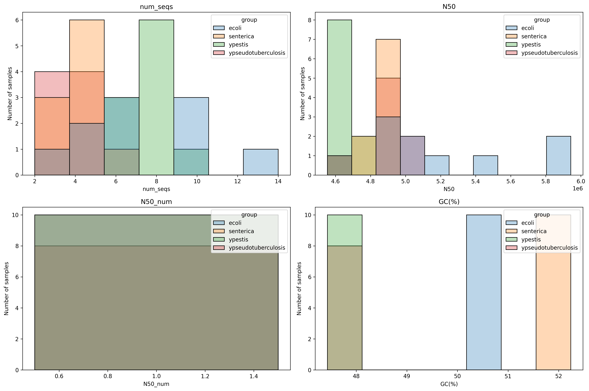
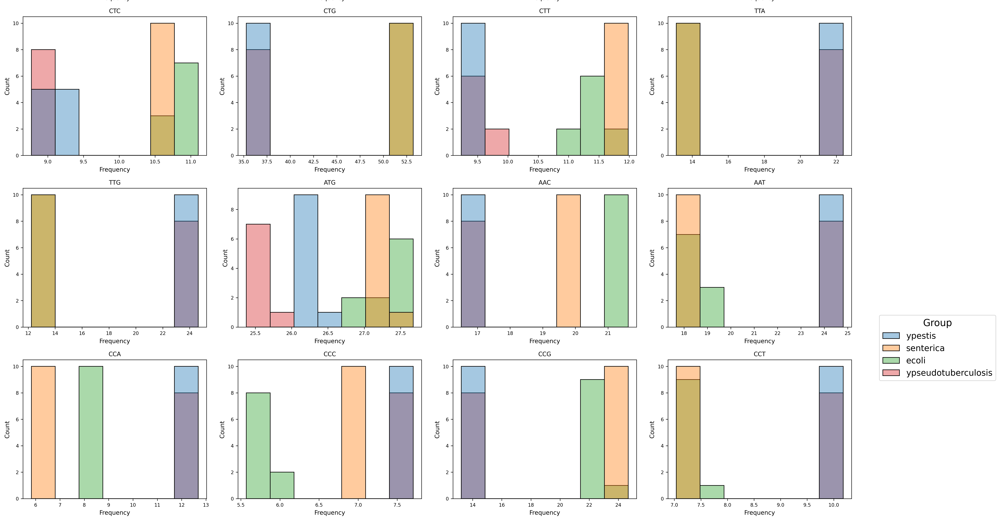
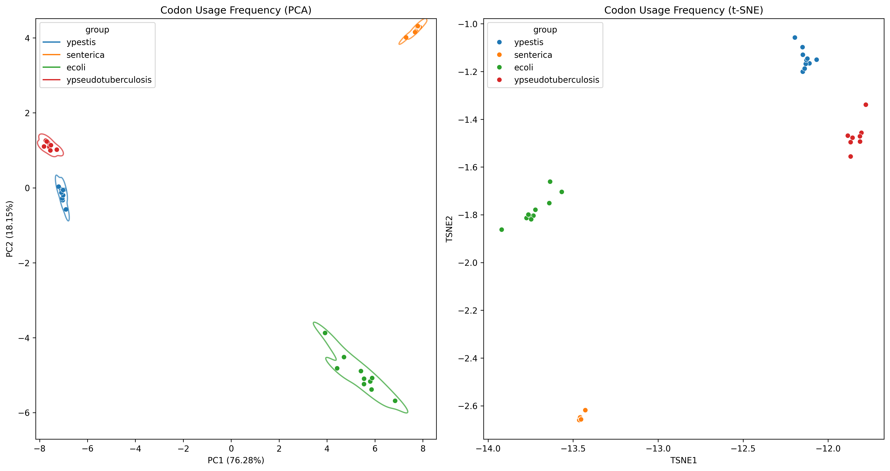
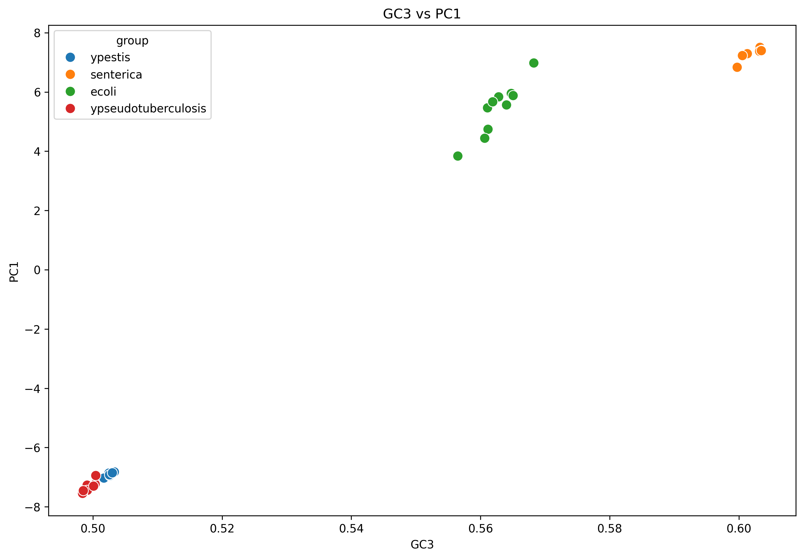
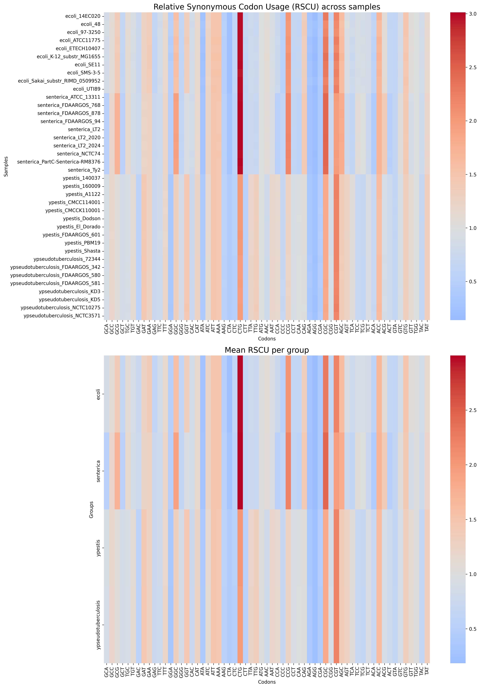

   
# Codon Usage Analysis
Exploratory analysis of codon usage bias across microbial genomes using codon frequencies, RSCU and ENC metrics combined with genome similarity analysis.
## Quick start
Prepare a working directory and a directory containing genome assemblies in FASTA format. Then use preprocessing.sh:
``` commandline
$ bash preprocessing.sh /absolute/path/to/folders/with/genomes/in/fasta
```
Then configure the notebook:
```python
HAS_GROUPS = True
WORKDIR = '/path/to/working/directory'
```
Then run all cells.
> It is possible to add group names into samples separated with `_`. 
> For example, `group1_ecoli_48.fasta` will be recognized as a sample from the `group1`.

## Repository Structure
```
codon-usage
│
├── README.md
│
├── requirements.txt
│
├── notebooks
│   └── codon_usage_analysis.ipynb
│
├── scripts
│   └── preprocessing.sh
│
└── plots
    ├── GC3_PC1.png
    ├── ...
    └── qc.png
```

## Overview
This project provides a ready-to-use notebook to explore codon usage patterns across microbial genomes and investigates whether codon bias reflects genome similarity or group structure.

The workflow includes:

- assembly quality control
- CDS annotation validation (comparison of CDS counts across samples)
- codon usage frequency analysis
- Relative Synonymous Codon Usage (RSCU)
- Effective Number of Codons (ENC)
- comparison with genome similarity using Mash distances

To visualize the data, dimensionality reduction methods (PCA and t-SNE) are used. 

## Workflow
The analysis consists of two stages.

### 1. Data preprocessing
Steps:
1. Assembly quality statistics (`seqkit`)
2. Genome annotation (`prokka`)
3. Codon usage calculation (`EMBOSS cusp`)
4. Genome distance estimation (`Mash`)

These steps are automated in `preprocessing.sh`. You can use it or do your own preprocessing.

### 2. Analysis
The main analysis is implemented in a Jupyter notebook: `codon_usage_analysis.ipynb`. 
The notebook performs:
- codon frequency analysis
- RSCU calculation
- ENC estimation
- GC3 vs PC1 exploration
- comparison with Mash genome distances using PCoA
- heatmap visualization
- PCA and t-SNE dimensionality reduction for visualization


## Installation
### Python requirements
- numpy>=2.0.2
- pandas>=2.2.3
- matplotlib>=3.9.3
- seaborn>=0.13.2
- scikit-learn>=1.5.2
- scikit-bio>=0.7.2
### Tools
- [seqkit](https://github.com/shenwei356/seqkit) (tested on `v2.13.0`)
- [Prokka](https://github.com/tseemann/prokka) (tested on `v1.11`)
- EMBOSS (`cusp`) (tested on `v6.6.0.0`)
- [Mash](https://github.com/marbl/Mash) (tested on `2.1`)
> All tools must be available in the system PATH.

Clone this repository
```commandline
$ git clone clone https://github.com/pour221/codon-usage.git
```

> It is recommended to use virtual environment (conda or venv)

Install python dependencies:
```commandline
$ pip install -r requirements.txt
```
And all needed tools (`seqkit`, `prokka`, `emboss`, `mash`) for preprocessing.

## Usage
### Step 1 — Prepare genomes
Create a working directory.
```commandline
$ mkdir codon_usage
```
Inside this directory create another one and place there genome assemblies in fasta format (`.fasta`, `.fa`, or `.fna`).
```commandline
$ cp -r working_sample/ codon_usage/
```
Genome filenames may optionally contain a group prefix, which will be used in downstream analysis.
Example:
```
group1_ecoli_01.fasta
group2_salmonella_01.fasta
```
Group labels are extracted automatically from the filename prefix.
So, for now your working directory should be:
```
codon_usage
└── working_sample
    ├── group1_ecoli_01.fasta
    ├── ...
    └── groupN_ecoli_N.fasta
```
### Step 2 — Run preprocessing
Run the preprocessing pipeline (or do this step by yourself):
```commandline
$ bash scripts/preprocessing.sh codon_usage/working_sample
```
That will generate several directories and plenty files. At the end the working the directory will be:

```
codon_usage
├── assembly_stats.tsv
├── cds.txt
├── working_sample
│   ├── group1_ecoli_01.fasta
│   ├── ...
│   └── groupN_ecoli_N.fasta
├── ffn
│   ├── group1_ecoli_01.ffn
│   ├── ...
│   └── groupN_ecoli_N.ffn
├── freq
│   ├── group1_ecoli_01.tsv
│   ├── ...
│   └── groupN_ecoli_N.tsv
├── kmers
│   ├── genomes.msh
│   └── mash.dist.tsv
└── prokka
    ├── group1_ecoli_01
    │   ├── group1_ecoli_01.ffn
    │   ├── ...
    │   └── group1_ecoli_01.err
    └── ...
```
### Step 3 — Run analysis
Open the notebook (`notebooks/codon_usage_analysis.ipynb`)
Then configure the notebook:
```python
HAS_GROUPS = True # or False
WORKDIR = '/path/to/working/directory'
```
and run all cells.
> Note: t-SNE is used as an additional nonlinear embedding for visualization.
## Example Results
- Assembly QC:

- Codon usage frequency per group

- Codon usage PCA and t-SNE

- GC3 VS PC1

- RSCU heatmap


All genomes used for testing were obtained from NCBI GenBank and are publicly available.
